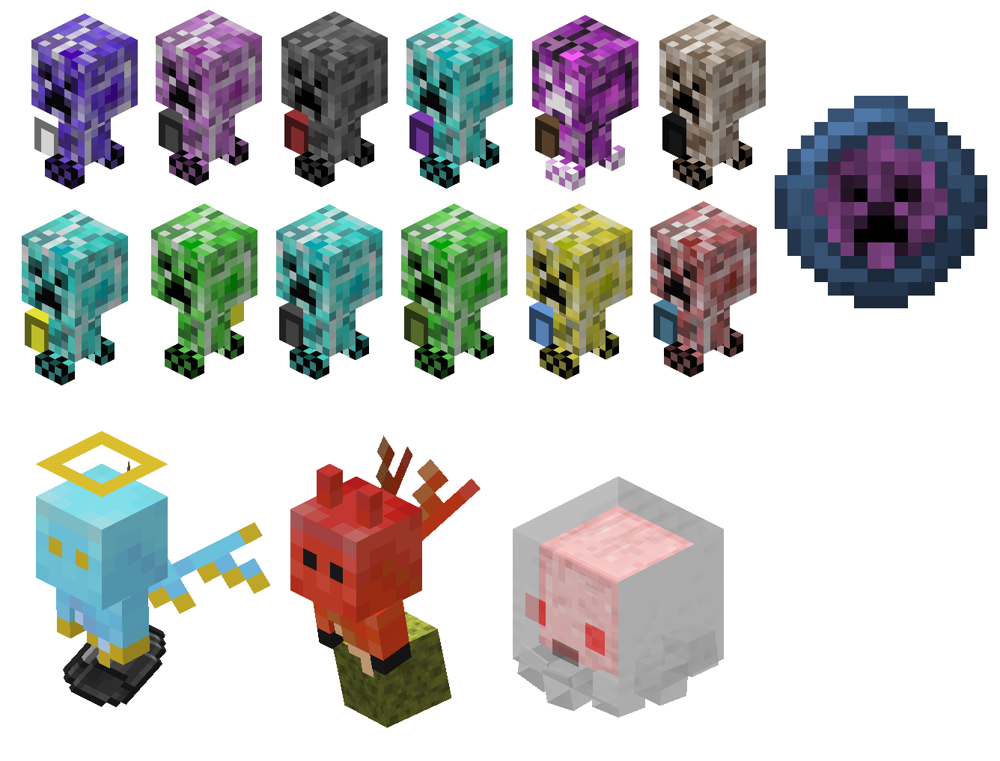

# TinyPals Minecraft 1.19.2 mod

Theres tiny creepers out theres, and they all wanna be your friend. Throw some TNT and they will grabt hem and turn into a charm. When ready summon and they will fight for you. You can rename them, dye their bags and find up to 8 variants. Variants are Biome specific. When they die they just turn back into a charm. Yes, their bags are functional and they will grab any item they find around them for you to sort later at teh end of your adventures.
Rain and Fire Summons are WIP to change rain to sunny and back.
Ghast is also WIP.

